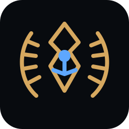

<p align="center">
  
</p>

<h1 align="center">AgentFoundry</h1>

<p align="center"><strong>Forge your local intelligence.</strong></p>

<p align="center">
  Local AI model management · hardware-aware tuning · agent orchestration
</p>

AgentFoundry is an open-source desktop manager for local AI models and agent runtimes. It aims to make GGUF models, llama.cpp, hardware-aware tuning, and agent frameworks such as Hermes easy to configure and launch from one place.

The visual identity combines a restrained Greco-Roman mythic language with a practical developer-tool interface: obsidian surfaces, marble-white text, imperial-gold accents and subtle digital-god archetypes for major subsystems.

## What it does

- Import and manage local GGUF models
- Start/stop a local `llama.cpp` OpenAI-compatible server
- Launch Hermes against the selected local endpoint
- Store per-model profiles for context size, GPU layers, KV cache, RoPE/YaRN and reasoning mode
- Detect basic Windows hardware information
- Show runtime status and logs
- Keep large model files outside GitHub

## Current reference profile

The first built-in profile mirrors a tested Windows setup:

- Qwen3-14B Abliterated
- IQ4_XS GGUF
- 65,536 token context
- 20 GPU layers
- quantized Q4_0 KV cache on CPU
- YaRN/RoPE scaling
- reasoning disabled
- llama.cpp OpenAI endpoint on `127.0.0.1:8080`
- Hermes Chat Completions integration

## Interface direction

The desktop UI follows the AgentFoundry design system:

- **Minerva** — model intelligence and profiles
- **Vulcan** — runtime and hardware tuning
- **Jupiter** — system/orchestration state
- **Hermes** — agents and tool connections
- **Apollo** — performance and benchmarks

These mythic names are secondary labels only; technical controls remain explicit and readable.

See [`docs/DESIGN.md`](docs/DESIGN.md) for the full design language.

## Quick start (development)

Requirements:

- Windows 10/11
- Python 3.11+
- `llama-server.exe` available in `PATH`
- Hermes CLI available as `hermes`
- a local GGUF model

```powershell
py -m venv .venv
.\.venv\Scripts\Activate.ps1
pip install -e .
agentfoundry
```

The default model path can be changed inside the app.

## Roadmap

### v0.1

- Windows desktop MVP
- GGUF model selection
- llama.cpp runtime management
- configurable context/GPU/KV settings
- Hermes launcher
- status + logs
- AgentFoundry dark mythic UI

### v0.2

- Hugging Face downloads with resume
- RAM/VRAM detection and presets
- persistent model library

### v0.3

- automated benchmark/tuning
- safe GPU-layer search
- hardware profile export/import

### v0.4+

- Ollama integration
- additional runtimes
- Linux support
- community hardware profiles
- model catalog

## Repository layout

```text
AgentFoundry/
├── assets/
│   └── agentfoundry-mark.svg
├── docs/
│   └── DESIGN.md
├── src/agentfoundry/
│   ├── app.py
│   ├── theme.py
│   ├── runtime.py
│   └── profiles.py
├── model-manifests/
├── scripts/
├── tests/
├── .github/workflows/
├── pyproject.toml
└── README.md
```

## Models

Large model files are **not committed to this repository**. AgentFoundry will support importing existing GGUF files and later downloading models from external providers such as Hugging Face.

## Brand principle

> **Mythology creates atmosphere. The interface creates trust.**

Promotional art may use male and female digitized classical deities, subtle circuitry, temple architecture and celestial motifs. Inside the desktop application, those elements stay restrained so the product remains a serious technical tool.

## Status

Early development / MVP.

Contributions and hardware profiles are welcome.

---

<p align="center"><em>Modern tools. Ancient wisdom. Local power.</em></p>
