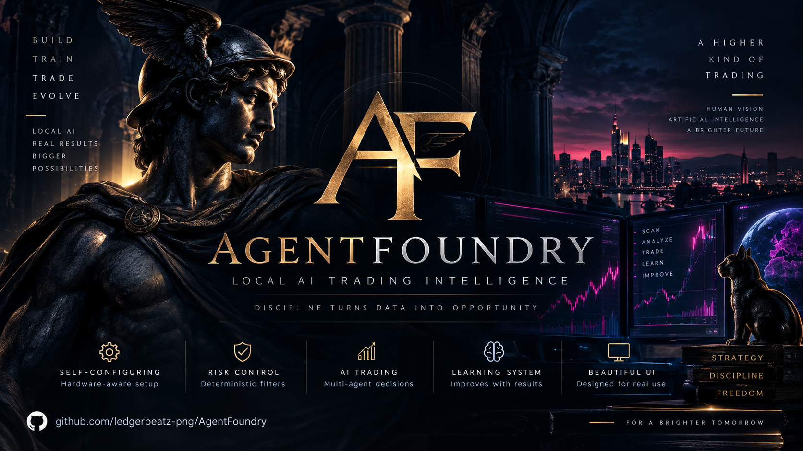

<p align="center">
  
</p>

<h1 align="center">AgentFoundry</h1>

<p align="center"><strong>FORGE YOUR TRADING INTELLIGENCE</strong></p>

<p align="center">
  Local AI · self-configuring · risk-controlled · learning from every paper trade
</p>

AgentFoundry is a local AI trading research platform designed to configure itself around the hardware it runs on. It combines GGUF model management, llama.cpp optimization, Hermes orchestration, deterministic risk controls, multi-agent analysis, adaptive paper-trade position management and evidence-based strategy learning.

AgentFoundry now also includes an early **Virtual Creator Studio** capability pack:
character continuity, structured image/video briefs, mandatory human approval and
provider-neutral jobs for Google Flow and Higgsfield. See
[`docs/VIRTUAL_CREATOR_STUDIO.md`](docs/VIRTUAL_CREATOR_STUDIO.md).

The **Mercury Social Command** pack acts as a project-aware marketing operator:
it stores separate brand identities, audiences and goals, builds multi-channel
campaign calendars, prepares channel-specific drafts, enforces approval modes and
triages community responses. External publishing remains adapter-driven so each
account can be enabled independently.

The current trading stack is deliberately **paper-only**. AgentFoundry records why a simulated trade was opened, held, partially closed or exited, then measures the outcome so candidate strategies can be replayed and validated before promotion. Paper or historical results do not guarantee future performance.

The visual identity combines a restrained Greco-Roman mythic language with a practical developer-tool interface: obsidian surfaces, marble-white text, imperial-gold accents and subtle digital-god archetypes for major subsystems.

## Trading intelligence

**SCAN → FILTER → RISK AI + ALPHA AI → PAPER ENTRY → POSITION MANAGER → OUTCOME → LEARN**

- **Forge / Self Setup** detects hardware and recommends a suitable local model/runtime profile
- **Apollo** benchmarks GPU offload and 1 / 2 / 4 concurrent local AI workers
- Deterministic hard-risk gates run before AI interpretation
- Parallel RISK and ALPHA roles are designed to analyze surviving opportunities
- The paper Position Manager evaluates HOLD / PARTIAL SELL / EXIT decisions
- MFE and MAE measure how much upside was available and how much downside was experienced
- Exit Strategy Lab replays the same market path against multiple exit policies
- SQLite Trade Memory stores decisions and later outcomes for reproducible evaluation
- Strategy candidates must pass minimum-sample promotion gates before advancing

See [Trading Packs](docs/TRADING_PACKS.md), [Self Setup](docs/SELF_SETUP.md) and [Evidence & Marketing](docs/EVIDENCE_AND_MARKETING.md).

## What it does

- Import and manage local GGUF models
- Start/stop a local `llama.cpp` OpenAI-compatible server
- Launch Hermes against the selected local endpoint
- Store per-model profiles for context size, GPU layers, KV cache, RoPE/YaRN and reasoning mode
- Detect basic Windows hardware information
- Show runtime status and logs
- Keep large model files outside GitHub
- Install/discover research capability packs such as the paper-only Solana Research pack

## Current reference profile

The first built-in profile mirrors a tested Windows setup:

- Qwen3-14B Abliterated
- IQ4_XS GGUF
- 65,536 token context
- 20 GPU layers
- quantized Q4_0 KV cache on CPU
- YaRN/RoPE scaling
- reasoning disabled
- llama.cpp OpenAI endpoint on `127.0.0.1:8080`
- Hermes Chat Completions integration

## Interface direction

The desktop UI follows the AgentFoundry design system:

- **Minerva** — model intelligence and profiles
- **Vulcan** — runtime and hardware tuning
- **Jupiter** — system/orchestration state
- **Hermes** — agents and tool connections
- **Apollo** — performance and benchmarks

These mythic names are secondary labels only; technical controls remain explicit and readable.

See [`docs/DESIGN.md`](docs/DESIGN.md) for the full design language.

## Quick start (development)

Requirements:

- Windows 10/11
- Python 3.11+
- `llama-server.exe` available in `PATH`
- Hermes CLI available as `hermes`
- a local GGUF model

```powershell
py -m venv .venv
.\.venv\Scripts\Activate.ps1
pip install -e .
agentfoundry
```

The default model path can be changed inside the app.

## Roadmap

### v0.1

- Windows desktop MVP
- GGUF model selection
- llama.cpp runtime management
- configurable context/GPU/KV settings
- Hermes launcher
- status + logs
- AgentFoundry dark mythic UI

### v0.2

- Hugging Face downloads with resume
- RAM/VRAM detection and presets
- persistent model library

### v0.3

- automated benchmark/tuning
- safe GPU-layer search
- hardware profile export/import

### v0.4+

- Ollama integration
- additional runtimes
- Linux support
- community hardware profiles
- model catalog

## Repository layout

```text
AgentFoundry/
├── assets/
│   └── agentfoundry-mark.svg
├── docs/
│   └── DESIGN.md
├── src/agentfoundry/
│   ├── app.py
│   ├── theme.py
│   ├── runtime.py
│   └── profiles.py
├── model-manifests/
├── scripts/
├── tests/
├── .github/workflows/
├── pyproject.toml
└── README.md
```

## Models

Large model files are **not committed to this repository**. AgentFoundry will support importing existing GGUF files and later downloading models from external providers such as Hugging Face.

## Brand principle

> **Mythology creates atmosphere. The interface creates trust.**

Promotional art may use male and female digitized classical deities, subtle circuitry, temple architecture and celestial motifs. Inside the desktop application, those elements stay restrained so the product remains a serious technical tool.

## Status

**Early development / research MVP. Paper trading only.**

The project is currently building the complete loop from self-configuration to auditable paper decisions, position management, outcome tracking and conservative strategy evolution.

Contributions and hardware profiles are welcome.

---

<p align="center"><em>Modern tools. Ancient wisdom. Local power.</em></p>
